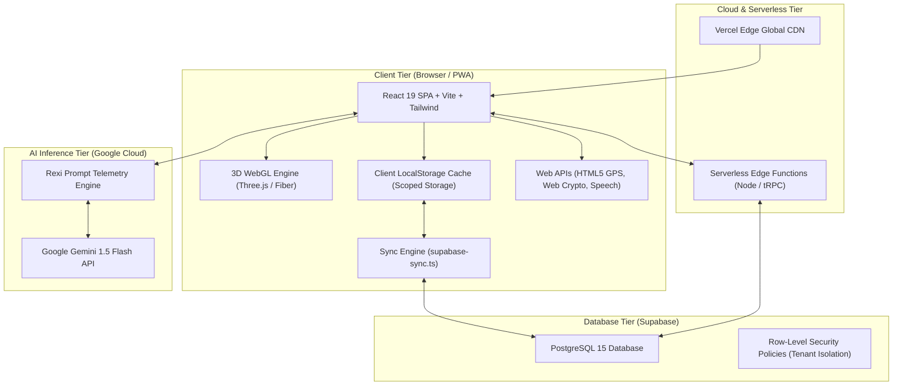
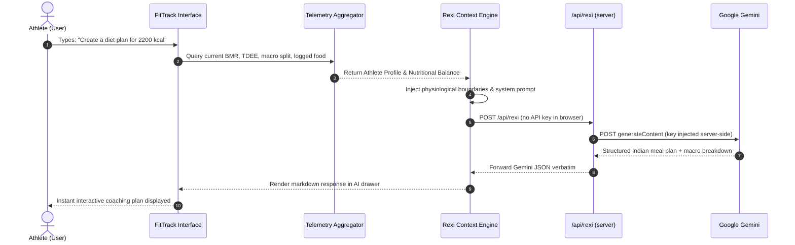
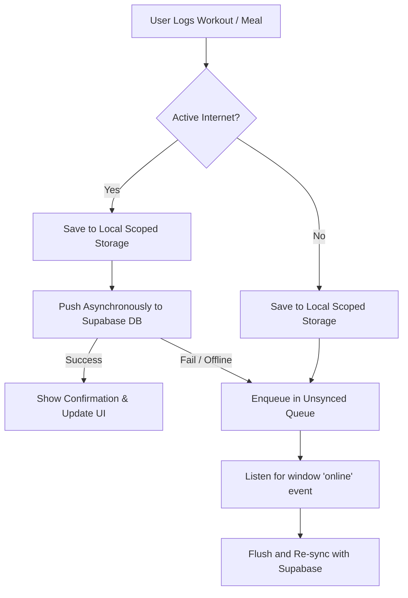

# 🏛️ System Architecture Document
## FitTrack — Performance Operating System
**Smart India Hackathon 2026 (SIH 2026)**

---

## 1. High-Level Architecture Overview

FitTrack is designed as a **modern, cloud-native, offline-resilient Single Page Application (SPA)** that combines client-side high-speed computing with cloud serverless elasticity and generative AI inference.



---

## 2. Architectural Layers

### 2.1 Presentation & UI Layer
* **Framework**: React 19.2.1 running on Vite 7.1.9 for ultra-fast Hot Module Replacement (HMR) and sub-second asset bundling.
* **Component Architecture**: Atomic component design combining headless accessible primitives (**Radix UI**) with high-performance CSS utilities (**Tailwind CSS v4**).
* **Kinetic Animations**: **Framer Motion 12** provides hardware-accelerated spring animations for dialogs, cards, metric rings, and screen transitions.
* **Routing**: Lightweight client-side hash/path router via **Wouter 3.7** maintaining a microscopic bundle size ($<12\text{ kB}$).

### 2.2 3D Graphics & Telemetry Layer
* **Rendering Engine**: **Three.js 0.185** with `@react-three/fiber` (React reconciler) and `@react-three/drei` (helpers).
* **3D Anatomy Canvas**: Renders high-fidelity anatomical meshes depicting 10 distinct muscle clusters with custom vertex/fragment shaders and emissive materials that update dynamically based on fatigue scores.
* **Orbital Readiness Form**: Interactive mathematical torus knot geometries rotating dynamically on the Home dashboard to visually encode daily athletic recovery readiness (0–100).

### 2.3 State Management & Data Layer
* **Dual-Tier Storage Architecture**:
  1. **Immediate Local Cache**: All user transactions (workouts, weigh-ins, meals, preferences) are committed synchronously to browser `localStorage` under scoped keys (`fittrack_*__<clean_email>`). This guarantees zero UI lag and full offline availability.
  2. **Asynchronous Cloud Sync**: Background synchronization workers (`supabase-sync.ts`) push and pull delta records to Supabase PostgreSQL without blocking the main render thread.

### 2.4 AI Intelligence Layer (Rexi Engine)
* **Model**: Google Gemini via HTTPS REST, called through a same-origin server proxy (`/api/rexi`) so the API key stays server-side; falls back to built-in coaching answers when no key is configured.
* **Dynamic Context Augmentation (RAG-Lite)**:
  * The client intercepts the athlete's prompt and injects live physiological metrics (BMR, TDEE, consumed calories, target deficit, experience tier, recent workouts, device time), then forwards the request to the `/api/rexi` proxy, which relays it to Gemini.
  * Ensures advice is physiologically safe and mathematically aligned with the athlete's active caloric goals.



---

## 3. Security Architecture & Multi-Tenancy

### 3.1 Per-User Data Scoping
Every row in the cloud database is keyed to the athlete's unique identifier (`user_email`), and the API layer filters every read and write by the authenticated athlete's email so one athlete never sees another's data. PostgreSQL Row-Level Security policies keyed on `public.current_athlete_email()` are also defined in `supabase/schema.sql` for direct-DB access; note that the server currently connects with the service-role key, so the API-layer scoping (not RLS) is the enforced boundary on the app path.

```sql
-- Database-Enforced Session Context
CREATE OR REPLACE FUNCTION public.current_athlete_email()
RETURNS VARCHAR AS $$
BEGIN
    RETURN NULLIF(current_setting('request.jwt.claims', true)::json->>'email', '');
EXCEPTION
    WHEN OTHERS THEN
        RETURN NULL;
END;
$$ LANGUAGE plpgsql STABLE SECURITY DEFINER;

-- Multi-Tenant Isolation Policy
CREATE POLICY "athlete_isolation_policy" 
ON public.workout_logs
FOR ALL 
USING (user_email = public.current_athlete_email() OR user_email = current_user);
```

### 3.2 Cryptographic Client-Side Security
* **Credential Protection**: Passwords entered through email authentication are hashed client-side using the native **Web Crypto API** (`crypto.subtle.digest("SHA-256")`) before transmission or local verification.
* **Google Identity Services (GIS) Token Validation**: Google OAuth JWT tokens are cryptographically parsed and checked against `client_id` audience claims (`aud`) and expiration timestamps (`exp`) to prevent token substitution attacks.

---

## 4. Offline-First & Network Resilience Architecture



* **Zero Data Loss**: In basements or intermittent gym deadzones, workouts and food logs are written instantly to local storage.
* **Auto-Reconciliation**: The moment connectivity returns, `supabase-sync.ts` detects the connection, authenticates, and commits all queued sessions in chronological order.

---

## 5. Deployment & Infrastructure Pipeline

* **Target Hosting Platform**: Vercel Serverless Edge Platform (Undeployed in pre-hackathon phase; ready for instant deployment at competition kickoff).
* **Source Control**: Git GitHub Monorepo (`https://github.com/ANIKETCHAND/fit.git` branch `main`).
* **Continuous Deployment (CI/CD)**: Every push to `main` triggers automated asset compilation (`vite build`), tree-shaking, chunk optimization, and atomic global edge deployment within 45 seconds.
* **Zero Infrastructure Maintenance**: All compute nodes are serverless edge instances; the database is a managed cloud PostgreSQL instance on Supabase.
