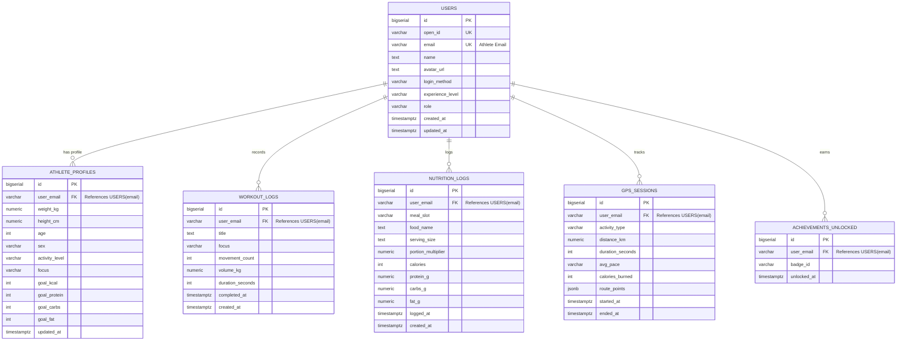

# 🗄️ Database Schema & Storage Architecture
## FitTrack — PostgreSQL 15 & LocalStorage Engine
**Smart India Hackathon 2026 (SIH 2026)**

---

## 1. Architecture Overview

FitTrack employs a **hybrid storage architecture**:
1. **Cloud Persistent Layer**: **PostgreSQL 15** hosted on Supabase with strict **Row-Level Security (RLS)**, ensuring complete multi-tenant athlete isolation.
2. **Edge Client Storage Layer**: Namespace-scoped browser `localStorage` ensuring instant zero-latency UI rendering and offline-first availability.



---

## 2. Relational Table Specifications

### 2.1 Table: `public.users`
Stores athlete authentication credentials, identity metadata, and account roles.

```sql
CREATE TABLE IF NOT EXISTS public.users (
    id BIGSERIAL PRIMARY KEY,
    open_id VARCHAR(64) UNIQUE,
    email VARCHAR(320) UNIQUE NOT NULL,
    name TEXT,
    avatar_url TEXT,
    login_method VARCHAR(64) DEFAULT 'custom',
    experience_level VARCHAR(32) DEFAULT 'beginner',
    role VARCHAR(32) DEFAULT 'user',
    last_signed_in TIMESTAMPTZ DEFAULT NOW(),
    created_at TIMESTAMPTZ DEFAULT NOW() NOT NULL,
    updated_at TIMESTAMPTZ DEFAULT NOW() NOT NULL
);
```

| Column | Type | Constraints | Default | Description |
| :--- | :--- | :--- | :--- | :--- |
| `id` | `BIGSERIAL` | Primary Key | Auto-increment | Unique system identifier. |
| `open_id` | `VARCHAR(64)` | Unique, Nullable | `NULL` | OAuth provider identity token / UID. |
| `email` | `VARCHAR(320)`| Unique, Not Null | - | Athlete's verified email address (Tenant Key). |
| `name` | `TEXT` | Nullable | `'Athlete'` | Display name. |
| `avatar_url` | `TEXT` | Nullable | `NULL` | Profile picture URL or base64 avatar data. |
| `login_method` | `VARCHAR(64)` | Nullable | `'custom'` | `'custom'` (Email/Password) or `'google'` (OAuth2). |
| `experience_level` | `VARCHAR(32)`| Nullable | `'beginner'` | `'beginner'`, `'intermediate'`, or `'advanced'`. |
| `created_at` | `TIMESTAMPTZ` | Not Null | `NOW()` | Timestamp of account registration. |

---

### 2.2 Table: `public.athlete_profiles`
Maintains biometric telemetry, anthropometry measurements, and daily nutritional goals.

```sql
CREATE TABLE IF NOT EXISTS public.athlete_profiles (
    id BIGSERIAL PRIMARY KEY,
    user_email VARCHAR(320) NOT NULL REFERENCES public.users(email) ON DELETE CASCADE UNIQUE,
    weight_kg NUMERIC(6, 2) DEFAULT 75.00 NOT NULL,
    height_cm NUMERIC(5, 1) DEFAULT 175.0 NOT NULL,
    age INT DEFAULT 24 NOT NULL,
    sex VARCHAR(16) DEFAULT 'male',
    activity_level VARCHAR(32) DEFAULT 'moderate' NOT NULL,
    focus VARCHAR(180) DEFAULT 'Hypertrophy & Progressive Overload' NOT NULL,
    goal_kcal INT DEFAULT 2400 NOT NULL,
    goal_protein INT DEFAULT 160 NOT NULL,
    goal_carbs INT DEFAULT 260 NOT NULL,
    goal_fat INT DEFAULT 65 NOT NULL,
    updated_at TIMESTAMPTZ DEFAULT NOW() NOT NULL
);
```

---

### 2.3 Table: `public.workout_logs`
Chronological ledger of executed training protocols, loads, and tonnage volume.

```sql
CREATE TABLE IF NOT EXISTS public.workout_logs (
    id BIGSERIAL PRIMARY KEY,
    user_email VARCHAR(320) NOT NULL REFERENCES public.users(email) ON DELETE CASCADE,
    title TEXT NOT NULL,
    focus VARCHAR(64) NOT NULL,
    movement_count INT DEFAULT 3 NOT NULL,
    volume_kg NUMERIC(10, 2) DEFAULT 0.00 NOT NULL,
    duration_seconds INT DEFAULT 0 NOT NULL,
    completed_at TIMESTAMPTZ DEFAULT NOW() NOT NULL,
    created_at TIMESTAMPTZ DEFAULT NOW() NOT NULL
);
```

---

### 2.4 Table: `public.nutrition_logs`
Daily dietary intake records categorized by meal slots with exact macro splits.

```sql
CREATE TABLE IF NOT EXISTS public.nutrition_logs (
    id BIGSERIAL PRIMARY KEY,
    user_email VARCHAR(320) NOT NULL REFERENCES public.users(email) ON DELETE CASCADE,
    meal_slot VARCHAR(64) DEFAULT 'Breakfast' NOT NULL,
    food_name TEXT NOT NULL,
    serving_size TEXT DEFAULT '1 serving',
    portion_multiplier NUMERIC(4, 2) DEFAULT 1.00 NOT NULL,
    calories INT NOT NULL,
    protein_g NUMERIC(6, 1) DEFAULT 0.0 NOT NULL,
    carbs_g NUMERIC(6, 1) DEFAULT 0.0 NOT NULL,
    fat_g NUMERIC(6, 1) DEFAULT 0.0 NOT NULL,
    logged_at TIMESTAMPTZ DEFAULT NOW() NOT NULL,
    created_at TIMESTAMPTZ DEFAULT NOW() NOT NULL
);
```

---

### 2.5 Table: `public.gps_sessions`
Outdoor route tracking records with distance, pace, and JSONB coordinate polyline paths.

```sql
CREATE TABLE IF NOT EXISTS public.gps_sessions (
    id BIGSERIAL PRIMARY KEY,
    user_email VARCHAR(320) NOT NULL REFERENCES public.users(email) ON DELETE CASCADE,
    activity_type VARCHAR(32) DEFAULT 'Run' NOT NULL,
    distance_km NUMERIC(6, 2) DEFAULT 0.00 NOT NULL,
    duration_seconds INT DEFAULT 0 NOT NULL,
    avg_pace VARCHAR(16) DEFAULT '00:00',
    calories_burned INT DEFAULT 0,
    route_points JSONB DEFAULT '[]'::jsonb,
    started_at TIMESTAMPTZ DEFAULT NOW() NOT NULL,
    ended_at TIMESTAMPTZ DEFAULT NOW() NOT NULL
);
```

---

### 2.6 Table: `public.achievements_unlocked`
Gamification records of earned badges and athletic milestones.

```sql
CREATE TABLE IF NOT EXISTS public.achievements_unlocked (
    id BIGSERIAL PRIMARY KEY,
    user_email VARCHAR(320) NOT NULL REFERENCES public.users(email) ON DELETE CASCADE,
    badge_id VARCHAR(64) NOT NULL,
    unlocked_at TIMESTAMPTZ DEFAULT NOW() NOT NULL,
    UNIQUE(user_email, badge_id)
);
```

---

## 3. Row-Level Security (RLS) Policies

Row-Level Security is strictly enabled on all tables. A database-level security definer function retrieves the active athlete's email claim from the Supabase JWT.

```sql
-- 1. Helper function to read email from authenticated request claims
CREATE OR REPLACE FUNCTION public.current_athlete_email()
RETURNS VARCHAR AS $$
BEGIN
    RETURN NULLIF(current_setting('request.jwt.claims', true)::json->>'email', '');
EXCEPTION
    WHEN OTHERS THEN
        RETURN NULL;
END;
$$ LANGUAGE plpgsql STABLE SECURITY DEFINER;

-- 2. Enable RLS on all tables
ALTER TABLE public.users ENABLE ROW LEVEL SECURITY;
ALTER TABLE public.athlete_profiles ENABLE ROW LEVEL SECURITY;
ALTER TABLE public.workout_logs ENABLE ROW LEVEL SECURITY;
ALTER TABLE public.nutrition_logs ENABLE ROW LEVEL SECURITY;
ALTER TABLE public.gps_sessions ENABLE ROW LEVEL SECURITY;
ALTER TABLE public.achievements_unlocked ENABLE ROW LEVEL SECURITY;

-- 3. Tenant Isolation Policies
CREATE POLICY "users_tenant_isolation" ON public.users FOR ALL 
USING (email = public.current_athlete_email() OR email = current_user);

CREATE POLICY "profiles_tenant_isolation" ON public.athlete_profiles FOR ALL 
USING (user_email = public.current_athlete_email() OR user_email = current_user);

CREATE POLICY "workouts_tenant_isolation" ON public.workout_logs FOR ALL 
USING (user_email = public.current_athlete_email() OR user_email = current_user);

CREATE POLICY "nutrition_tenant_isolation" ON public.nutrition_logs FOR ALL 
USING (user_email = public.current_athlete_email() OR user_email = current_user);

CREATE POLICY "gps_tenant_isolation" ON public.gps_sessions FOR ALL 
USING (user_email = public.current_athlete_email() OR user_email = current_user);

CREATE POLICY "achievements_tenant_isolation" ON public.achievements_unlocked FOR ALL 
USING (user_email = public.current_athlete_email() OR user_email = current_user);
```

---

## 4. Client-Side LocalStorage Namespace Mapping

To guarantee seamless multi-account usage on shared computers and full offline operation, keys are partitioned using `getScopedKey(baseKey, userEmail)`:

| Logical Entity | Scoped Storage Key Pattern | Stored Schema Format |
| :--- | :--- | :--- |
| **Athlete Profile** | `fittrack_profile__<email>` | JSON: `{ name, email, location, focus, photoDataUrl }` |
| **Calibration Settings**| `fittrack_calibration__<email>` | JSON: `{ weightKg, heightCm, age, sex, activityLevel, goalKcal, ... }` |
| **Daily Nutrition Today**| `fittrack_logged_nutrition_today__<email>` | JSON Array: `[{ id, name, kcal, p, c, f, meal, time }]` |
| **Workout Logs** | `fittrack_workout_logs__<email>` | JSON Array: `[{ title, focus, movementCount, volumeKg, completedAt }]` |
| **GPS Sessions** | `fittrack_gps_sessions__<email>` | JSON Array: `[{ id, distanceKm, duration, pace, routePoints }]` |
| **Daily Streak State** | `fittrack-daily-streak__<email>` | JSON: `{ count, lastLoggedDate, highestStreak }` |
| **Credential Hash** | `fittrack_cred_hash__<email>` | String: SHA-256 hex digest of local user password |
| **Supabase Config** | `fittrack_supabase_url` / `..._anon_key` | String: Project Cloud credentials |
