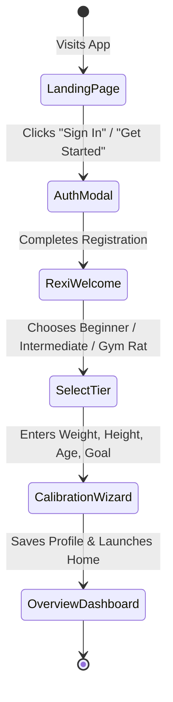
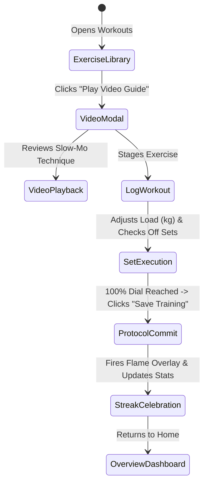

# 🎨 Design System & UI/UX Specification
## FitTrack — Carbon Editorial Performance Deck
**Smart India Hackathon 2026 (SIH 2026)**

---

## 1. Design Philosophy: "Carbon Editorial Performance Deck"

FitTrack breaks away from generic, sterile white fitness apps. It is engineered with an **editorial, dark-mode sports telemetry design system**:
* **OLED-Optimized Immersion**: Deep charcoal, slate, and obsidian backgrounds reduce battery drain and prevent eye strain in dimly lit gym weight rooms.
* **Kinetic High-Contrast Accents**: Electric lime (`#C6FF3D`) and cyber cyan (`#38BDF8`) highlight active muscle regions, readiness scores, and streaks.
* **Information Density with Breathing Room**: Telemetry cards are organized using clear visual hierarchies, typography pairing, and subtle borders rather than heavy container drop-shadows.

---

## 2. Color Palette & Design Tokens

```
  ┌───────────────────────────────────────────────────────────┐
  │                        CORE COLORS                        │
  ├──────────────┬──────────────┬──────────────┬──────────────┤
  │ #070908      │ #0B120E      │ #121914      │ #18231C      │
  │ Dark Base    │ Surface Dark │ Card Base    │ Elevated     │
  ├──────────────┼──────────────┼──────────────┼──────────────┤
  │ #C6FF3D      │ #38BDF8      │ #E7C6FF      │ #22C55E      │
  │ Electric Lime│ Cyber Cyan   │ Soft Lilac   │ Emerald OK   │
  ├──────────────┼──────────────┼──────────────┼──────────────┤
  │ #F59E0B      │ #EF4444      │ #EDF4E9      │ #8B9C8A      │
  │ Amber Alert  │ Crimson Rest │ Primary Text │ Muted Grey   │
  └──────────────┴──────────────┴──────────────┴──────────────┘
```

| Token | Hex Value | Purpose & Usage |
| :--- | :--- | :--- |
| `--bg-base` | `#070908` | Primary viewport background; deep obsidian canvas. |
| `--bg-surface` | `#0B120E` | Secondary panels, navigation rails, and modal dialogs. |
| `--bg-card` | `#121914` | Card background with 1px border `rgba(255,255,255,0.08)`. |
| `--accent-lime` | `#C6FF3D` | Primary action button, active route indicator, readiness highlights. |
| `--accent-cyan` | `#38BDF8` | Carbohydrate macro bar, GPS route polyline, timer badges. |
| `--accent-lilac` | `#E7C6FF` | Dietary fats indicator, milestone rewards accent. |
| `--status-ready` | `#22C55E` | Fully recovered muscle indicator, successful API connection. |
| `--status-recovering` | `#F59E0B` | Intermediate muscle fatigue (score 65–79%). |
| `--status-rest` | `#EF4444` | High fatigue muscle indicator (score <65%), error alerts. |
| `--text-primary` | `#EDF4E9` | Main headers, numerical telemetry, athlete identity. |
| `--text-muted` | `#8B9C8A` | Sub-labels, coaching descriptions, units (`kg`, `kcal`, `min`). |

---

## 3. Typography System

| Style / Role | Font Family | Weight | Tracking / Transform | Example Application |
| :--- | :--- | :--- | :--- | :--- |
| **Brand Display** | `Chakra Petch`, sans-serif | 700 / Bold | Uppercase, wide tracking | `"FITTRACK"`, `"GOOD MORNING"` |
| **Section Eyebrows** | `Space Mono`, monospace | 500 / Medium | Uppercase, `tracking-widest` | `"TRAINING RHYTHM"`, `"RECOVERY MAP"` |
| **Body & Labels** | `Inter`, -apple-system, sans-serif | 400 / 600 | Normal | Movement descriptions, meal ingredients |
| **Numerical Telemetry**| `Space Mono`, monospace | 700 / Bold | Monospaced tabular figures | `"82.5 kg"`, `"2,200 kcal"`, `"04:32 min/km"` |

---

## 4. Key UI Components & Design Patterns

### 4.1 The Editorial Sidebar Navigation Rail
* Desktop: Clean, slim vertical navigation rail with active lime border indicators.
* Mobile: Triggered via floating circular icon; slides out with smooth backdrop blur scrim.
* Actions: Navigation routes, 1-click Light/Dark mode switcher, notifications badge, support, and sign-out.

### 4.2 Kinetic Exercise Flip Cards
* **Front Face**: Displays movement title, target sets/reps input, equipment tag, tempo cue, and a dedicated glowing **"Watch Video"** button.
* **Back Face**: Smooth 3D perspective flip revealing setup positioning, primary contraction cues, and safety tips.
* **Target Dial**: Dynamic circular SVG progress ring that fills as exercises are checked off during the workout.

### 4.3 3D Muscle Studio Viewport
* **Interactive Three.js Canvas**: Smooth orbiting camera with touch and mouse drag controls.
* **Glow Shader Nodes**: Color-coded anatomical nodes pulsing on primary muscles (Pectorals, Lats, Quads, Deltoids).
* **Diagnostic Panel**: Glassmorphism side card displaying anatomical Latin terminology, weekly tonnage lifted, and scientific recovery status.

### 4.4 Nutrition Lab Meal Ledger
* **Dual-Tab Switcher**: Seamless toggle between *Quick Search (Indian Meals)* and *Custom Meal Builder (Raw Pantry)*.
* **Portion Pill Multipliers**: One-touch buttons (`0.5x`, `1x`, `1.5x`, `2x`) for instant portion recalculation.
* **Tri-Color Macro Ring**: Embedded circular progress gauge showing real-time Protein (Lime), Carbs (Blue), and Fat (Lilac) goals.

---

## 5. User Flows & Wireframe Walkthroughs

### 5.1 Athlete Onboarding Flow


### 5.2 Workout Execution & Video Guidance Flow


---

## 6. Accessibility & Responsive Standards
* **WCAG 2.1 AA Compliance**: All text-to-background contrast ratios exceed **4.5:1** (lime-on-black ratio exceeds **14:1**).
* **Touch Target Ergonomics**: All interactive buttons maintain a minimum tap target of **44 × 44 pixels** for easy gym thumb use.
* **Motion Accessibility**: Honors `prefers-reduced-motion` media queries by disabling camera spins and particle glows when requested.
