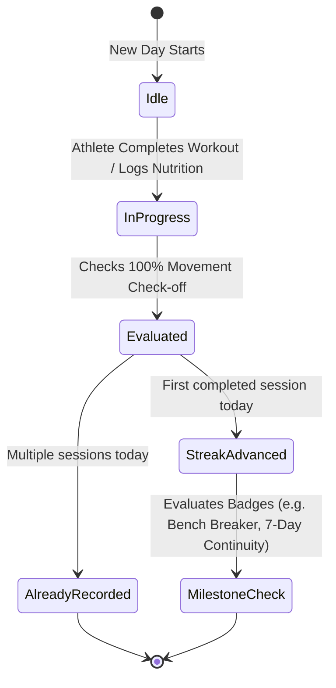

# 🧠 Business Logic & Core Algorithms Specification
## FitTrack — Performance Calculations & Telemetry Algorithms
**Smart India Hackathon 2026 (SIH 2026)**

---

## 1. Biometric Calibration Engine

FitTrack calculates baseline metabolic energy expenditure using the clinically validated **Mifflin-St Jeor Equations**, adjusted for biological sex, body mass, height, and age.

### 1.1 Basal Metabolic Rate (BMR)
$$\text{BMR}_{\text{male}} = (10 \times m_{\text{kg}}) + (6.25 \times h_{\text{cm}}) - (5 \times a_{\text{years}}) + 5$$

$$\text{BMR}_{\text{female}} = (10 \times m_{\text{kg}}) + (6.25 \times h_{\text{cm}}) - (5 \times a_{\text{years}}) - 161$$

Where:
* $m_{\text{kg}}$ = Body mass in kilograms
* $h_{\text{cm}}$ = Stature in centimeters
* $a_{\text{years}}$ = Age in calendar years

### 1.2 Total Daily Energy Expenditure (TDEE)
$$\text{TDEE} = \text{BMR} \times k_{\text{activity}}$$

| Activity Tier | Multiplier ($k_{\text{activity}}$) | Weekly Training Sessions |
| :--- | :---: | :--- |
| **Light** | $1.375$ | 1 to 2 sessions/week (Sedentary desk work with light activity) |
| **Moderate** | $1.550$ | 3 to 4 sessions/week (Standard active lifestyle) |
| **Active** | $1.725$ | 5 to 6 sessions/week (Consistent progressive overload lifter) |
| **Very Active** | $1.900$ | Daily or twice-daily intensive athletic training |

### 1.3 Macronutrient Target Distribution
To preserve and build lean muscle mass during resistance training:
1. **Target Protein**: Fixed at an athletic hypertrophy baseline of **$2.0\text{ g}$ per kilogram of body weight**:
   $$\text{Protein}_{\text{goal}} = \text{round}(m_{\text{kg}} \times 2.0) \quad [\text{grams}]$$
2. **Target Dietary Fat**: Calibrated to **$25\%$ of total daily caloric expenditure**:
   $$\text{Fat}_{\text{goal}} = \text{round}\left(\frac{\text{TDEE} \times 0.25}{9\text{ kcal/g}}\right) \quad [\text{grams}]$$
3. **Target Carbohydrates**: Fills the remaining caloric allocation for glycogen replenishment:
   $$\text{Carbs}_{\text{goal}} = \text{max}\left(0, \text{round}\left(\frac{\text{TDEE} - (\text{Protein}_{\text{goal}} \times 4 + \text{Fat}_{\text{goal}} \times 9)}{4\text{ kcal/g}}\right)\right) \quad [\text{grams}]$$

---

## 2. Muscle Recovery & Athletic Readiness Scoring Engine

### 2.1 Muscle Readiness & Fatigue Decay Function
Each of the 10 monitored muscle groups ($i \in \{1 \dots 10\}$) carries an individual recovery score $S_i(t) \in [0, 100]$. Following a resistance session, muscle tissue undergoes micro-trauma, followed by an asymptotic recovery curve over time $t$ (hours elapsed):

$$S_i(t) = S_0 + (100 - S_0) \times \left(1 - e^{-t / \tau}\right)$$

Where:
* $S_0$ = Residual post-training fatigue baseline (typically $35–45\%$ after high volume).
* $\tau$ = Recovery time constant (calibrated to $\approx 48–72\text{ hours}$ for major compound muscle groups).

| Readiness Score Range | Category | Color Hex | Recommended Action |
| :--- | :--- | :--- | :--- |
| **$80\% \le S_i \le 100\%$** | **Fully Recovered** | `#22C55E` (Emerald) | Primed for maximum load and heavy compound progression. |
| **$65\% \le S_i < 80\%$** | **Recovering** | `#F59E0B` (Amber) | Optimal for moderate load, accessory volume, or mobility flow. |
| **$S_i < 65\%$** | **Needs Rest** | `#EF4444` (Crimson) | High residual fatigue. Prioritize sleep and active recovery. |

### 2.2 Overall Daily Athletic Readiness Score (Home Dashboard)
The readiness score displayed on the Home dashboard is a weighted composite index ($R_{\text{composite}} \in [50, 98]$):

$$R_{\text{composite}} = R_{\text{base}} + \Delta_{\text{workout}} + \Delta_{\text{nutrition}} + \Delta_{\text{gps}} + \Delta_{\text{streak}}$$

Where:
* $R_{\text{base}} = 82$ (Baseline optimal readiness).
* $\Delta_{\text{workout}} = +10$ if a session was logged today, else $+4$.
* $\Delta_{\text{nutrition}} = +4$ if caloric intake exceeds $800\text{ kcal}$ with balanced protein.
* $\Delta_{\text{gps}} = +3$ if outdoor activity was completed.
* $\Delta_{\text{streak}} = \min(6, \text{streak\_count} \times 2)$.
* Bound strictly to $[50, 98]$ to reflect physiological bounds.

---

## 3. Indian Nutrition Scaling & Composite Meal Math

### 3.1 Single-Item Linear Scaling
For any food item logged from the Indian Food Database with base values ($K_0, P_0, C_0, F_0$) and portion multiplier $M \in \{0.5, 1.0, 1.5, 2.0, 3.0\}$:

$$\text{Calories} = K_0 \times M \quad [\text{kcal}]$$
$$\text{Protein} = P_0 \times M \quad [\text{grams}]$$
$$\text{Carbohydrates} = C_0 \times M \quad [\text{grams}]$$
$$\text{Fat} = F_0 \times M \quad [\text{grams}]$$

### 3.2 Custom Recipe Composite Aggregation
When an athlete builds a custom meal from raw ingredients (e.g., $60\text{g}$ Rolled Oats + $200\text{ml}$ Cow Milk):

$$\text{Kcal}_{\text{total}} = \sum_{j=1}^{n} \left(\frac{q_j}{100} \times K_{100, j}\right)$$
$$\text{Protein}_{\text{total}} = \sum_{j=1}^{n} \left(\frac{q_j}{100} \times P_{100, j}\right)$$
$$\text{Carbs}_{\text{total}} = \sum_{j=1}^{n} \left(\frac{q_j}{100} \times C_{100, j}\right)$$
$$\text{Fat}_{\text{total}} = \sum_{j=1}^{n} \left(\frac{q_j}{100} \times F_{100, j}\right)$$

Where $q_j$ is the measured quantity (in grams or milliliters) and $K_{100, j}$ is the nutrient per $100\text{g/ml}$.

---

## 4. GPS Outdoor Route & Pace Algorithms

### 4.1 Geodesic Displacement (Haversine Formula)
To calculate precise real-world distance between two sequential coordinates $(\phi_1, \lambda_1)$ and $(\phi_2, \lambda_2)$:

$$a = \sin^2\left(\frac{\Delta\phi}{2}\right) + \cos(\phi_1) \cdot \cos(\phi_2) \cdot \sin^2\left(\frac{\Delta\lambda}{2}\right)$$
$$c = 2 \cdot \text{atan2}\left(\sqrt{a}, \sqrt{1-a}\right)$$
$$d = R_{\text{earth}} \cdot c \quad (R_{\text{earth}} \approx 6,371\text{ km})$$

### 4.2 Noise Suppression & Velocity Gating
Smartphone GPS sensors frequently experience multi-path reflection errors. FitTrack suppresses noise using velocity threshold gating:
1. If positional accuracy uncertainty is $> 25\text{ meters}$, coordinate point is discarded.
2. If instantaneous calculated speed $v = \frac{\Delta d}{\Delta t} > 35\text{ km/h}$ ($9.72\text{ m/s}$) for running sessions, coordinate point is tagged as anomalous GPS drift and rejected.

### 4.3 Running Pace Telemetry
$$\text{Pace} = \frac{\Delta t_{\text{minutes}}}{\Delta d_{\text{kilometers}}} \quad [\text{min/km}]$$

---

## 5. Continuity & Streak State Machine



1. **Daily Reset Threshold**: Evaluated against the user's local device midnight boundary (`YYYY-MM-DD`).
2. **Grace Continuity**: If the previous completed date was yesterday (`today - 1`), streak count increments $S \leftarrow S + 1$. If a day was skipped ($>1$ day gap), streak resets to $1$.
3. **Milestone Triggers**:
   * **Bench Breaker**: Unlocked when Barbell Bench Press load is logged $\ge 85.0\text{ kg}$.
   * **Streak Master**: Unlocked upon maintaining unbroken 7-day training continuity.

---

## 6. Rexi AI Grounding & Guardrail Protocols

To prevent dangerous artificial hallucinations in health guidance, the **Rexi Context Engine** applies strict prompt augmentation rules before queries reach Gemini 1.5 Flash:

```typescript
// Context Injection Schema
const rexiTelemetryPrompt = `
ATHLETE TELEMETRY PROFILE:
- Name: ${athlete.name}
- Age: ${calibration.age} | Sex: ${calibration.sex}
- Mass: ${calibration.weightKg} kg | Height: ${calibration.heightCm} cm
- Caloric Target: ${calibration.goalKcal} kcal | Remaining Today: ${remainingKcal} kcal
- Protein Target: ${calibration.goalProtein} g | Logged Today: ${loggedProtein} g
- Experience Tier: ${experienceTier} (Beginner, Intermediate, or Gym Rat)

SAFETY BOUNDARIES:
1. Never recommend extreme caloric deficits below 1,200 kcal/day.
2. For Beginner lifters, always emphasize spinal neutral alignment and moderate progressive overload.
3. Ground nutritional suggestions in regional Indian whole foods (Dals, Paneer, Roti, Rice, Curd, Sprouts).
`;
```
